# SubBox: An app for subscription addict 

## Overview

With our hectic life, it can be difficult to make time and discover new ingredients or products. This is why SubBox is here to help. With clean and simple interface, SubBox is designed to easily navigate a huge variety of subscription boxes that are available in the market. Have fun using it.

## Features

###Main Page
####Online Image
- The user can scroll thru the list of items faster once the images from internet have been cache into the phone.
	- As a user, I can scroll thru the list of items when all the images have been loaded.
	
####Sort by price
- The user can sort items by price from low to high.
	- I can press the "sort by price" button to sort the list by price from low to high.
	
####Search by name or type
- The user can search by item name or type.
	- I can press the search button, input the search term and the item will show up that matches the search term.
	
####Search suggestion
- The user can see search suggestion when they press on the search icon.
	- I can see a list show up when the search button is pressed.
	
####Voice search
- The user can use voice search if they prefer.
	- I can see the microphone icon when I press the search icon. Upon pressing it, I can speak the term I want to search.
	
####Filter list
- The user can filter item with multiple category of item type.
	- When I click on the "Filter by", I am prompted with a list of categories to filter.

---
###Detail Page
####Show detail
- The user can click on the item in the main list to show details in other pane
	- When I click on the item, I can see detail info of the item in separate frame.
	
####Collapse detail toolbar
- When user scroll up, they can see the image in toolbar collapse, in turns providing more space for the details. 
	- When I scroll up for more details in the page, the image in the toolbar collapses so I have more screen space to view the details.
	
####Add to cart
- The user can add the item to cart from the details and indicate it is added with a toast and text change.
	- When I pressed the button, "Add to cart", a message shows up saying it is added to cart.

---
###Checkout Page
####Add or minus item count 
- The user can increase or decrease the count of the item in checkout page
	- When I press the plus or minus icon, the count goes up and down accordingly.
- If the count is zero, it is automatically removed.
	- When the count reached zero, I can see the item being automatically removed from checkout page.
	
####Show total price in real time
- The subtotal, tax and total price is being updated in real time when user increase or decrease item count.
	- I can see the prices being updated in real time as I add or decrease the count.
	
####Checkout clear
- The user can clear the checkout with a click of a button. 
	- When I clicked on the checkout button, I can see the items in my shopping cart being cleared out.

---
##Bonus
####Locale
- The user can use their default locale to display the price and date that match their locale. 
	- I can see the currency and date that matches my locale.
	
####History
- After the user checkout they can see their order history with total amount and transaction date.
	- When I clicked on the history icon, I can see the list of order ordered by the most recent.
	
####Transaction Detail
- The user can see the detail of the transaction when they click on the transaction, including time and price.
	- I can see the detail of the transaction when I clicked on it, including the individual item, total and the date. 
	
####Master Detail Flow
- The user can see a list and detail page when they are using a tablet in landscape mode
	- I can see the detail page, checkout, history and transaction details when I'm using a tablet in a landscape mode.
	
####Detail Title Marquee
- If the title gets too long in title in detail page, it will autoscroll horizontally so the user can see the full name
	- I can see the text scrolling sideway when it is too long or my screen size is too small.
	
####Detail, checkout and transaction persistence
- When the user rotate from portrait to landscape, the app keeps the page that they are currently viewing and display it the detail pane.
	- When I rotate from portrait to landscape, I can still see the page I was in on the right side of the app. 
	
####Checkout to detail
- When the user click on the item in in checkout, the app will bring up a detail page of the item the click on
	- When I click on the item in checkout, the app show up the detail of the item. 

---
##Prototype

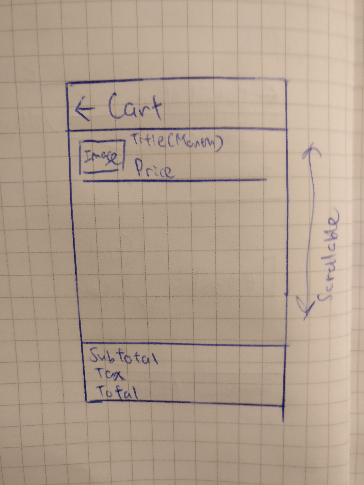
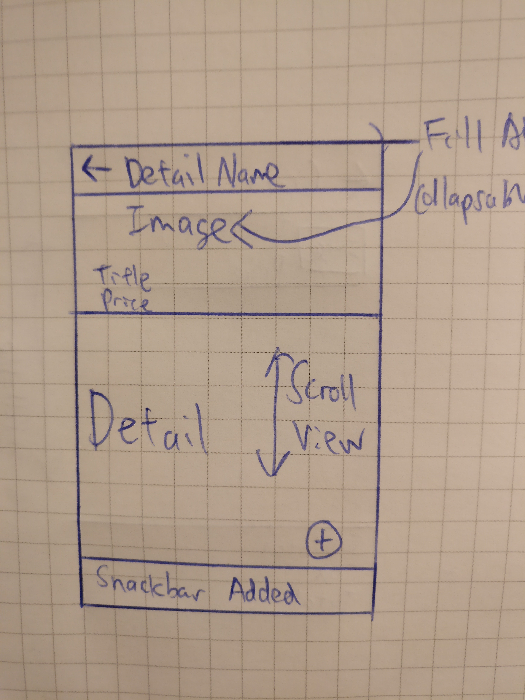
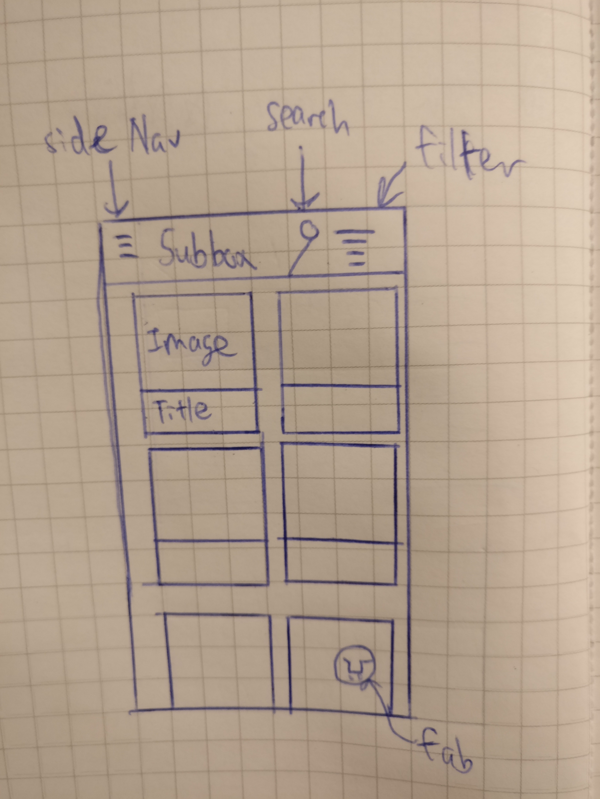

---
##ScreenShots
###SmartPhone

  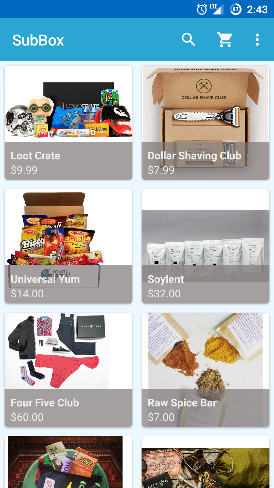 
  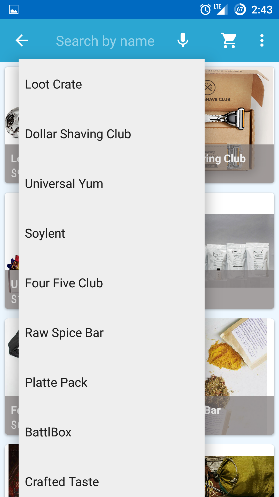 
  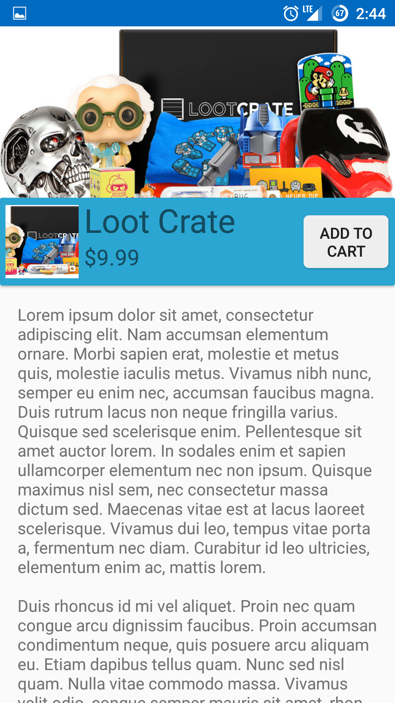  
  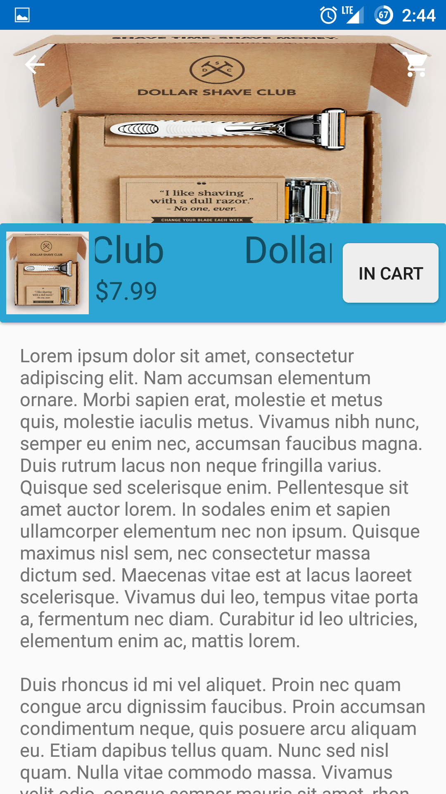 
  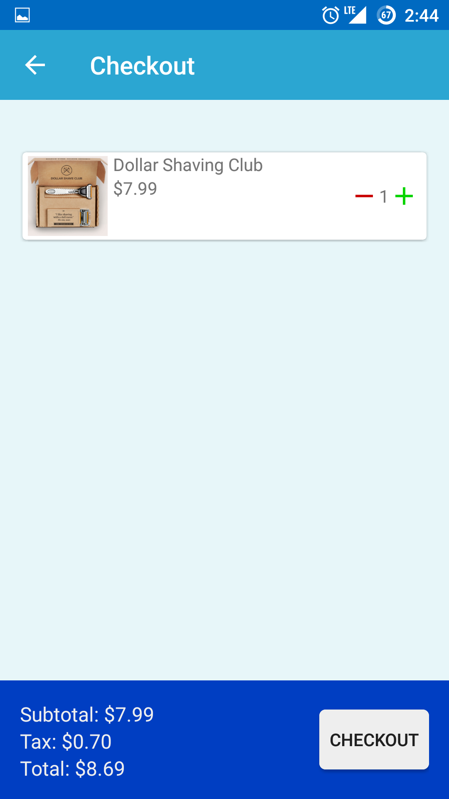  
  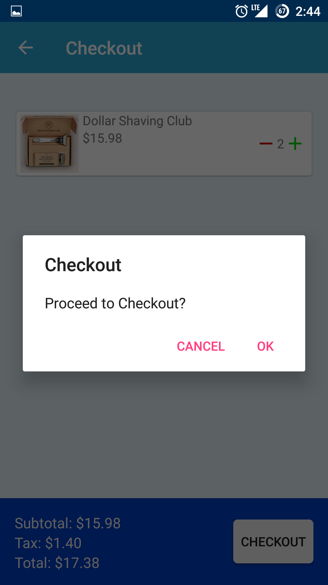  
  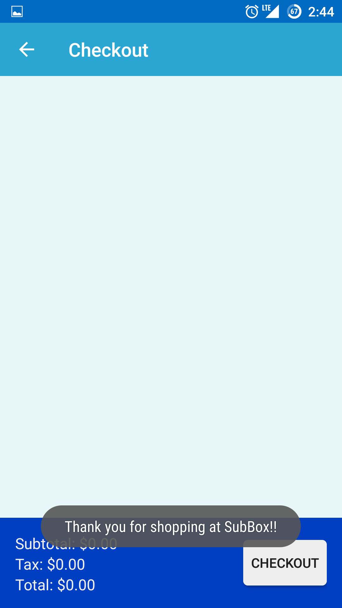  
  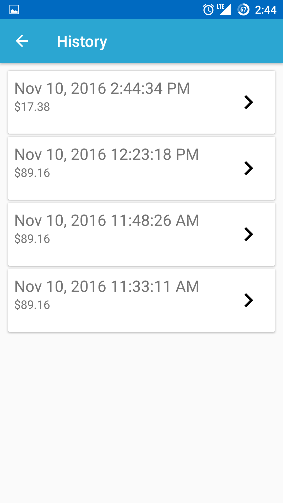  
  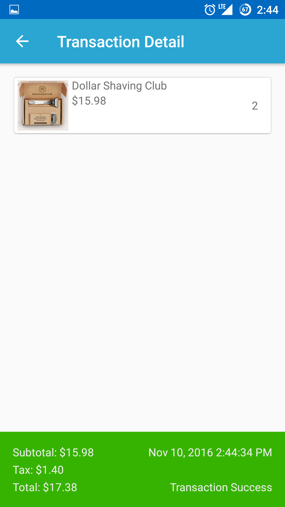

  
###Tablet

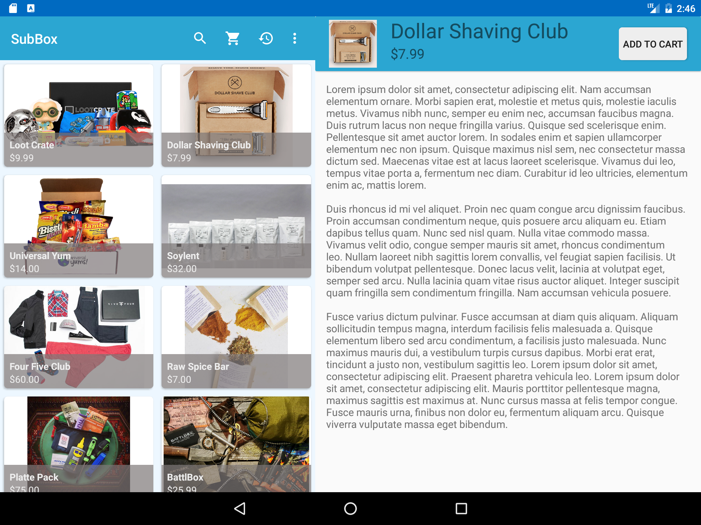  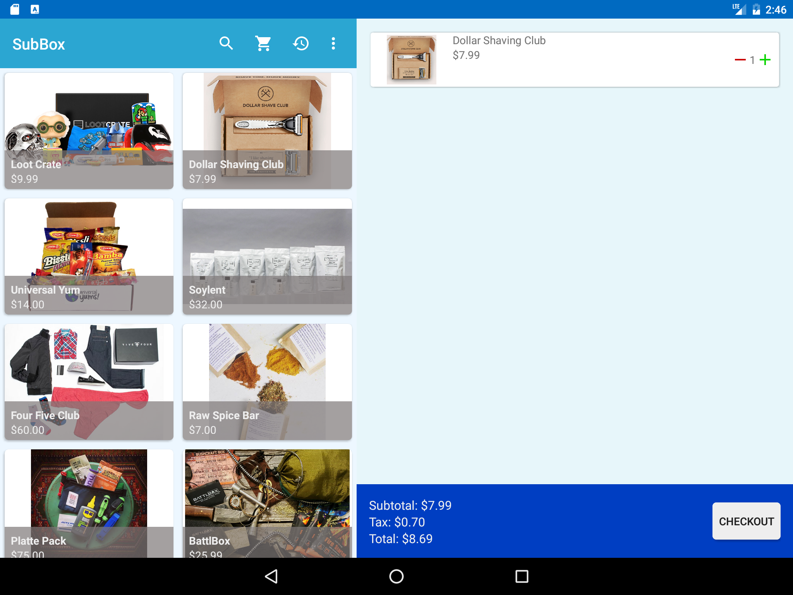 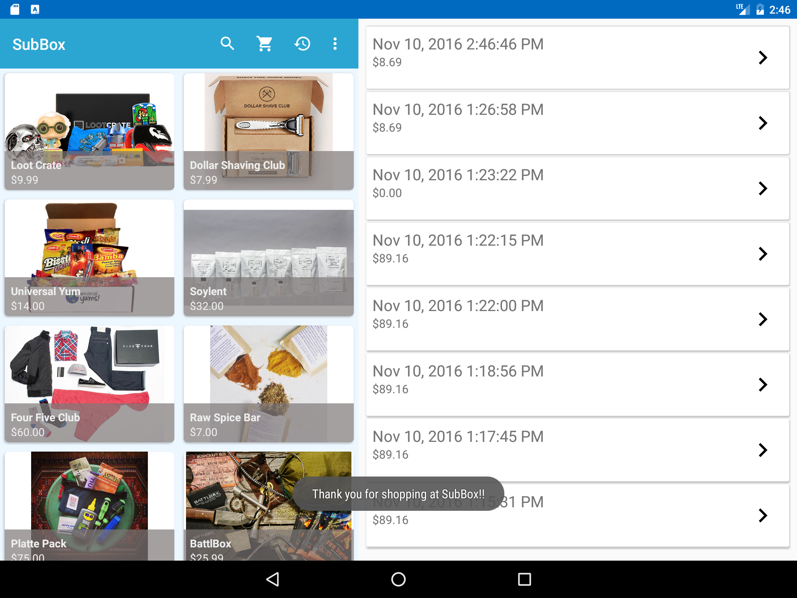 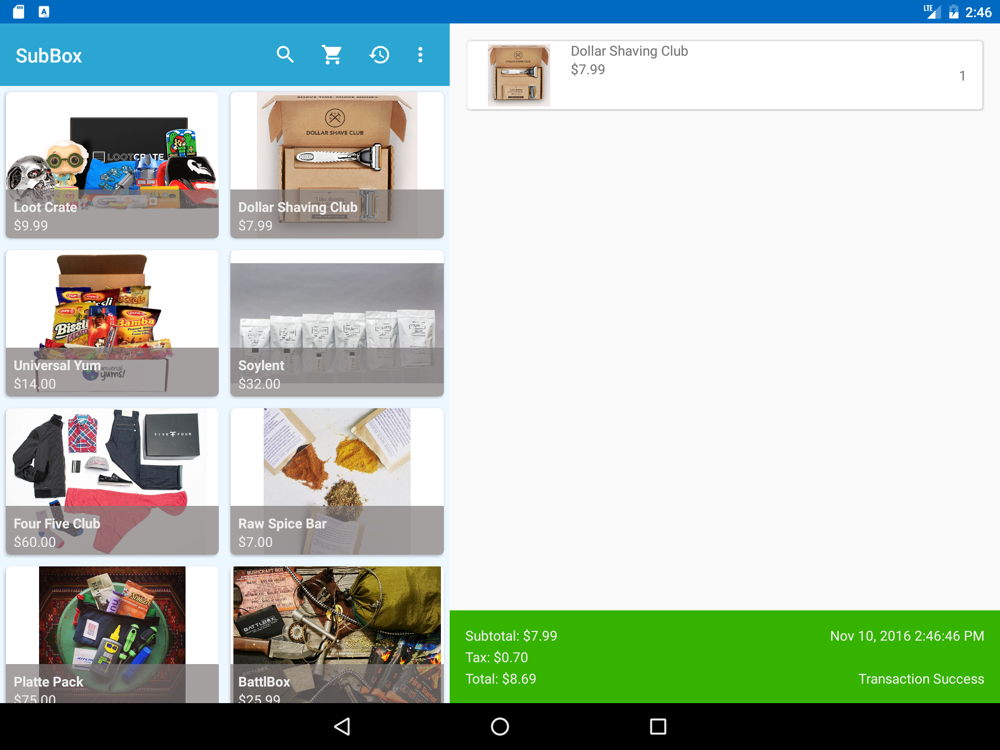 

